# Project Description
Car renting as an industry has grown significantly over the last few years. India has a large number of youth and most of them are not able to buy cars early in their lives. This problem has been solved by the car rental businesses through which they can rent cars by paying some fee. 

The car rental system developed in this project is able to let the user login, let the user sign up, and let the user book the car. It is also capable of saving the data of user in the database and manages it as the admin wants. The objective of the project was to fulfill the need of the people not owning a car but need a car at certain point for some period of time.

## Screenshots

### HOMEPAGE-
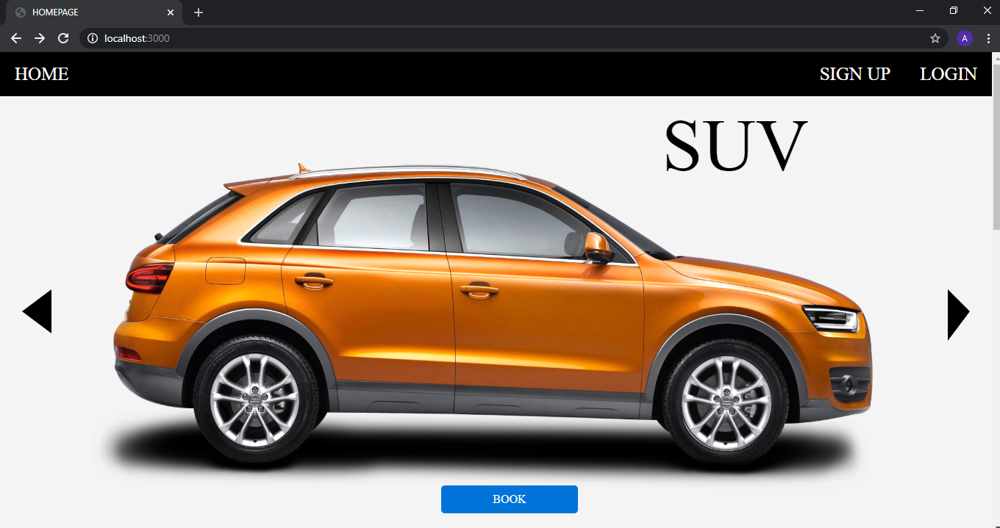

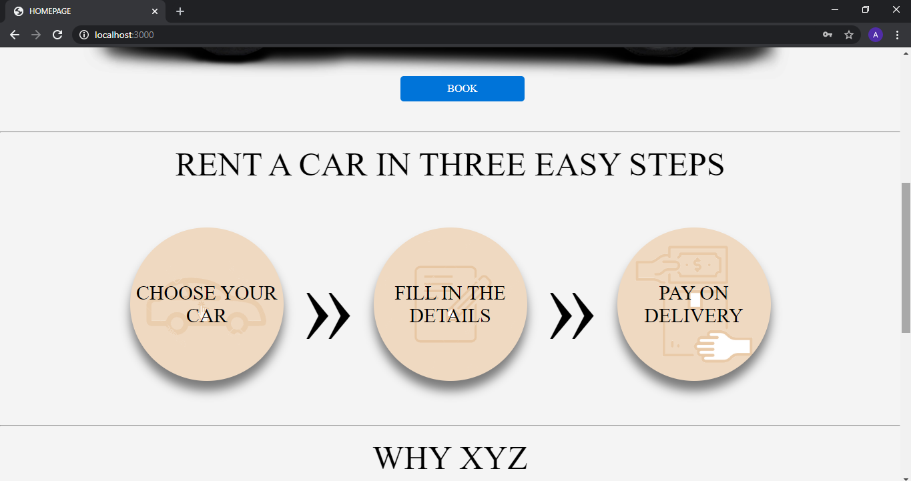

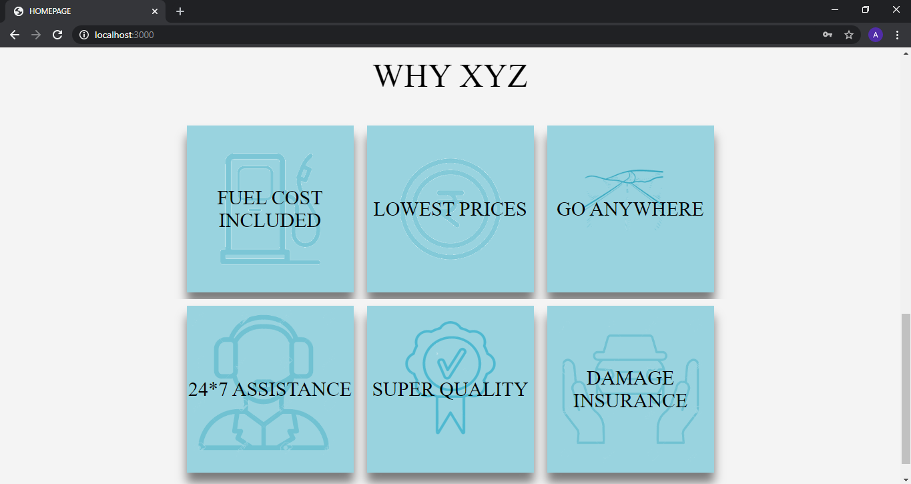

### LOGIN –

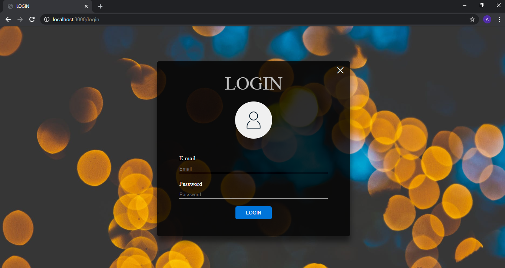

### SIGN UP-

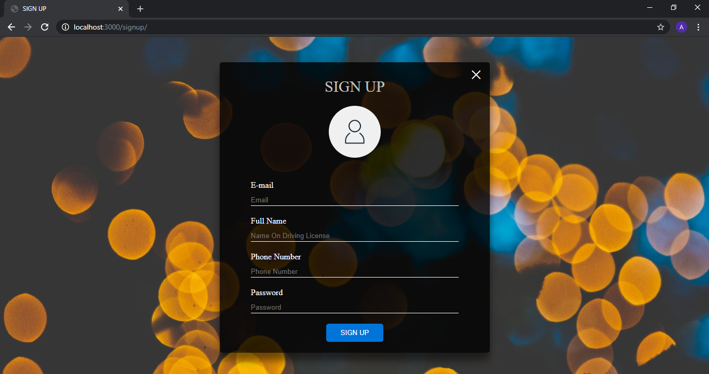
 
### HOMEPAGE AFTER LOGIN-

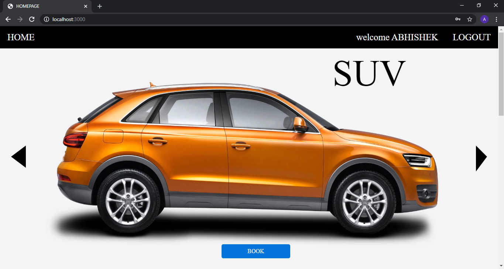

### BOOKING FORM-

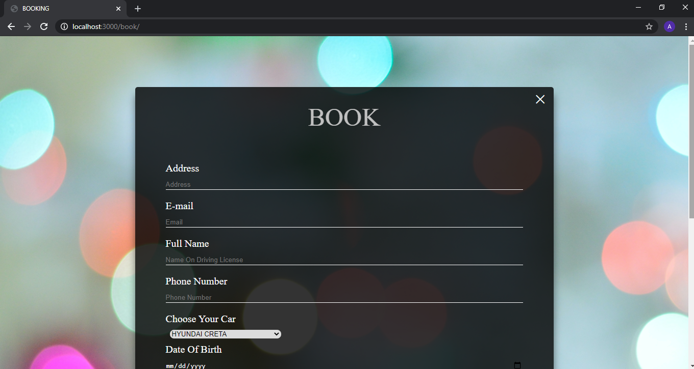

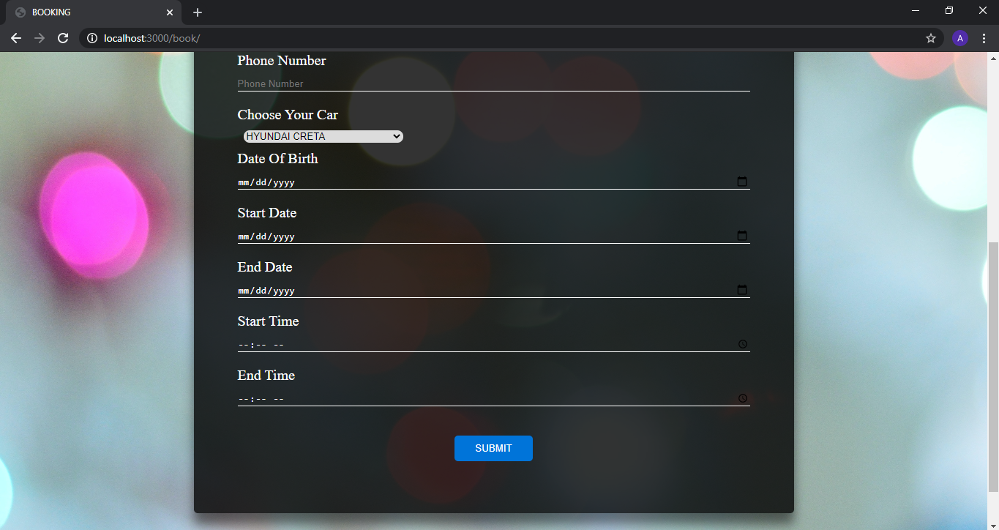

### SUV CAR LIST PAGE-

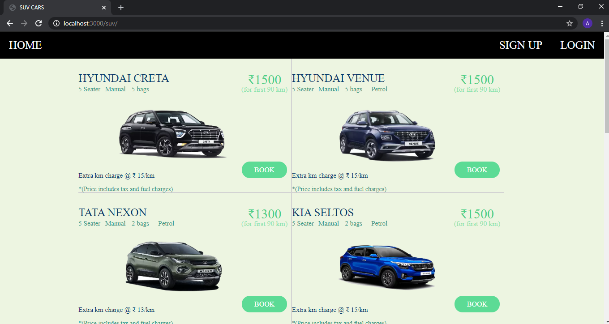

### SEDAN CARS LIST-

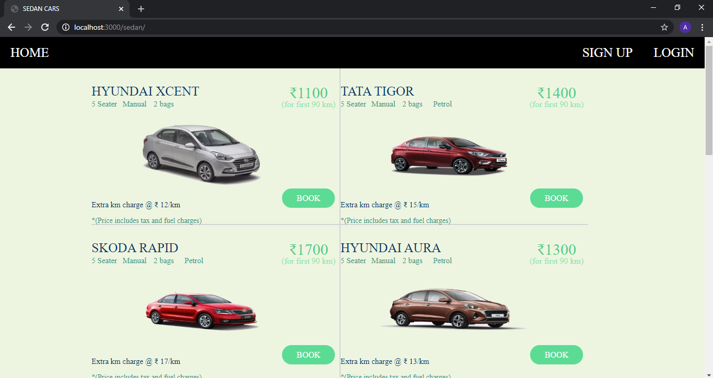

### HATCHBACK CARS LIST PAGE –

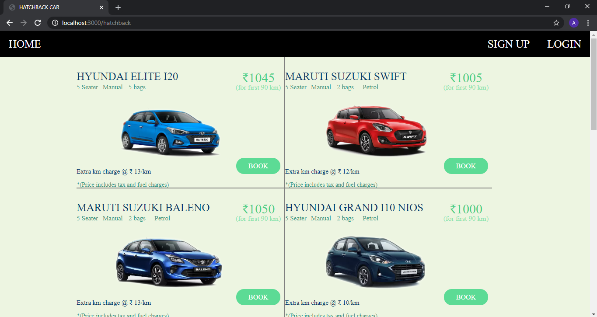

### ELECTRIC CARS LIST PAGE – 

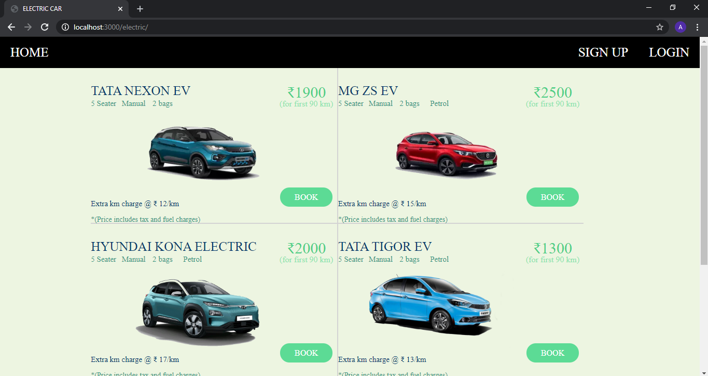

### AFTER BOOKING YOUR CAR-

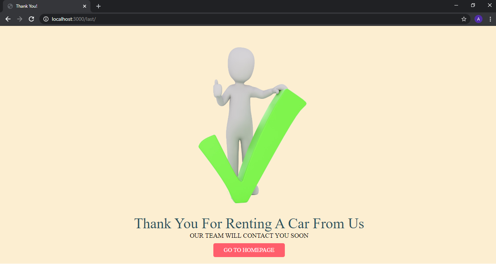
